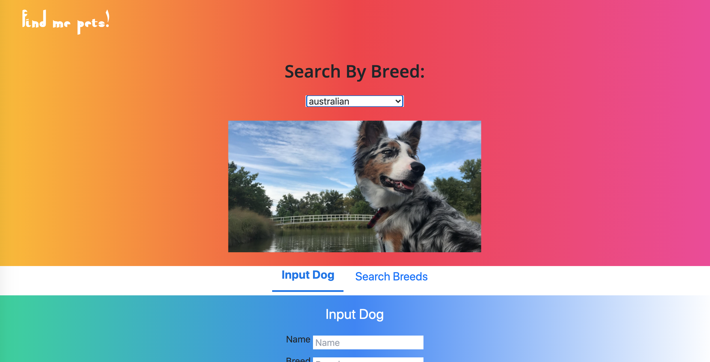

# Find Me Pets Full-Stack Website
Site created with HTML5, TailwindCSS, an API, PHP, MySQL, & JavaScript

## Table of contents
* [Screenshots](#screenshots)
* [General info](#general-info)
* [Technologies](#technologies)
* [Live Demo](#live-demo)
* [Status](#status)
* [Contact](#contact)
* [TODO](#TODO)

## Screenshots 

## General info
When I was trying to learn more about API's I spotted this cool YouTube video [here](https://www.youtube.com/watch?v=AVmGmLFcukM) and wondered how I could implement it into a project. This was my first project using PHP, MySQL and an API. I had used JavaScript and TailwindCSS before and really found TailwindCSS useful. Especially for media queries and making the page responsive, which I'll admit I struggle with a bit.

This app allows you to first search for different dog breeds using the dog API. Then once you have found a dog breed you like or want to enter, enter in the dogs name, breed, age, gender, and description along with an image of the dog. Then you can view that dog you just entered by searching for the breed.

## Technologies
* HTML5, TailwindCSS, API, PHP, MySQL, & JavaScript

## Live Demo
View live demo here: [Demo](https://find-me-pets.000webhostapp.com/)

## Status
Complete for now

## Contact
Created by [Ibsaa J Adam](https://github.com/ibsaajadam) - feel free to contact on:
You can find me also on:
* [Linkedin](https://www.linkedin.com/in/ibsaajadam/)
* [Github](https://github.com/ibsaajadam)

## TODO

* Get better at using API's and see what more PHP and MySQL can do along with other backend languages.
